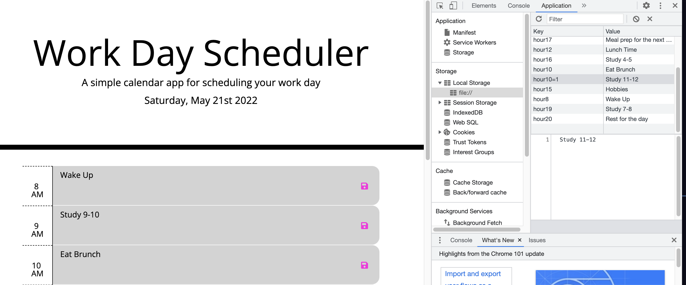

# workday-scheduler-kat

## Review

* The URL of the deployed application:

https://kattheswagger1122.github.io/workday-scheduler-kat/

* The URL of the GitHub repository. Give the repository a unique name and include a README describing the project:

https://github.com/kattheswagger1122/workday-scheduler-kat.git

# 05 Third-Party APIs: Work Day Scheduler

Create a simple calendar application that allows the user to save events for each hour of the day. This app will run in the browser and feature dynamically updated HTML and CSS powered by jQuery.
## User Story

```
AS AN employee with a busy schedule
I WANT to add important events to a daily planner
SO THAT I can manage my time effectively
```

## Acceptance Criteria

```
GIVEN I am using a daily planner to create a schedule
WHEN I open the planner
THEN the current day is displayed at the top of the calendar
WHEN I scroll down
THEN I am presented with timeblocks for standard business hours
WHEN I view the timeblocks for that day
THEN each timeblock is color coded to indicate whether it is in the past, present, or future
WHEN I click into a timeblock
THEN I can enter an event
WHEN I click the save button for that timeblock
THEN the text for that event is saved in local storage
WHEN I refresh the page
THEN the saved events persist
```

## Utilization
1. This workday scheduler show work hours of the day from 8 AM - 8 PM.
2. On the top of the page, the current day and date are displayed.
3. Each time block is color-coded to past future and present (grey, green and red)
4. You save the table to local storage and come back later (Once it has been saved, it will store in their local storage.)

## Screenshots

1. time table past present & future

2. Local Storage

---
© 2022 Trilogy Education Services, LLC, a 2U, Inc. brand. Confidential and Proprietary. All Rights Reserved.
